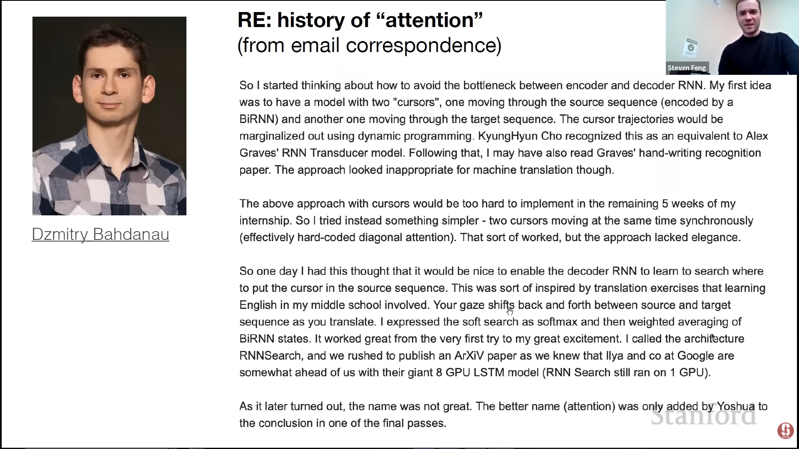

**Attention** has been first introduced by Bahdanau, D., Cho, K., & Bengio, Y. (2014), *Neural machine translation by jointly learning to align and translate*.

Since then, many optimizations and adaptations into other domains have led to different types of Attention.