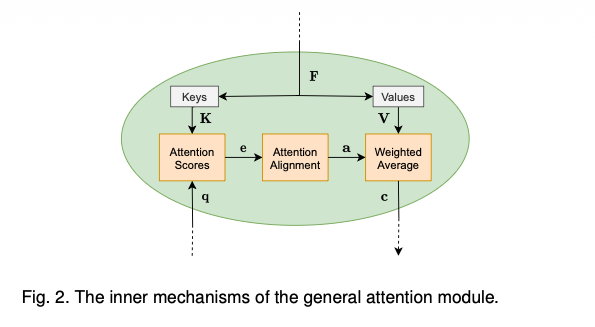
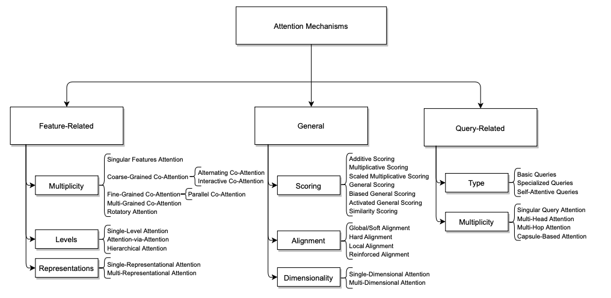
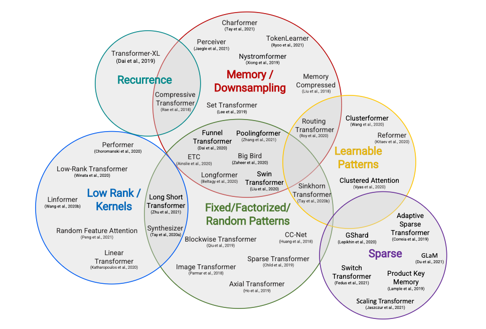

## Overview

The idea of mimicking human attention first arose in the field of computer vision in an attempt to reduce the computational complexity of image processing while improving performance by introducing a model that would only focus on specific regions of images instead of the entire picture. Although, the true starting point of the attention mechanisms we know today is often attributed to originate in the field of natural language processing, by Bahdanau, D., Cho, K., & Bengio, Y. (2014), *Neural machine translation by jointly learning to align and translate*.

Since then, many optimizations and adaptations into other domains have led to different types of Attention. But, the core structure remains the same as below, where `F` is a list of **features** `f`, `e` is the **attention scores** calculated with **keys** `K` and **query** `q`, `a` is the **attention weights** after **alignment** and `c` is the **context**, a weighted average of the **values** `V`.

## Attention Mechanisms

> Another line of work, different from the above mechanisms which are Query-driven, are the Attention mechanisms in Computer Vision which are based on Statistics, Predictions, Reinforcement Learning, etc. The Statistics-driven mechanims, though less expressive, are more compute efficient than O(N^2) of Query-driven mechanisms and are still widely used as alternatives where compute is limited. Read more at [cv_attention.pdf](cv_attention.pdf) 

## Optimizations

Another axis where Attention had developed is optimization of **Compute and Memory** usage. The below figure shows different attention mechanisms proposed in this regard. Read more at [attention_arch.pdf](attention_arch.pdf)

